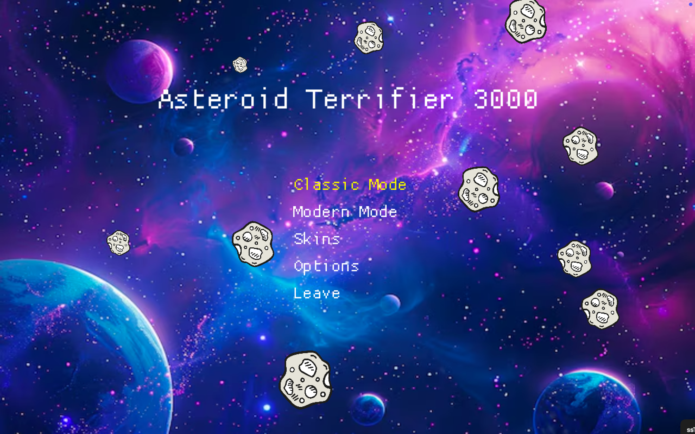
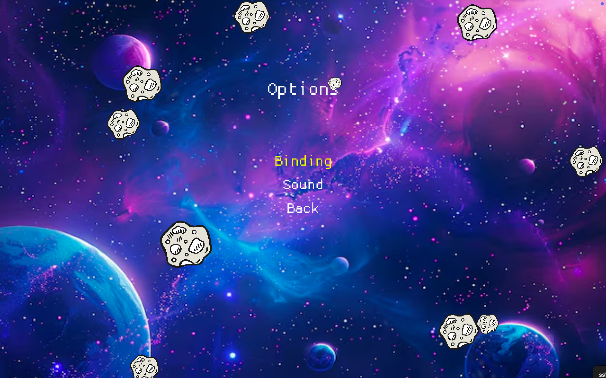
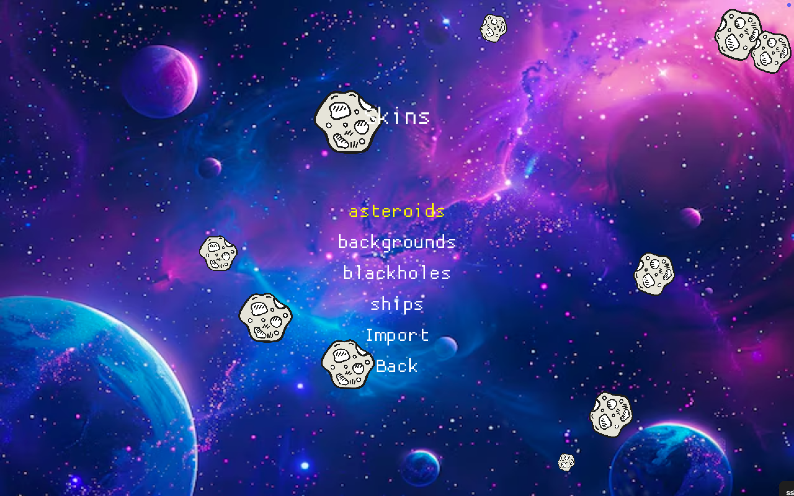
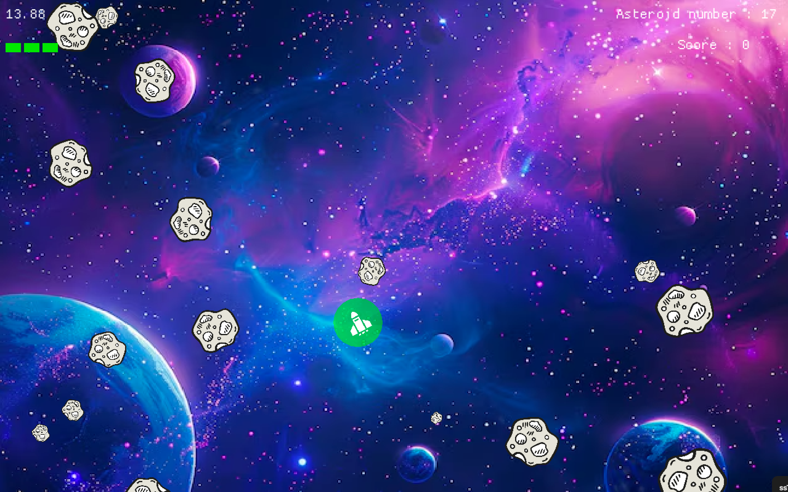

= Asteroid Terrifier 3000 🚀🌌

== Description 📋
Asteroid Destroyer est un jeu d'arcade classique développé en Rust. Dans ce jeu, vous pilotez un vaisseau spatial et devez détruire des astéroïdes tout en évitant les trous noirs. 🌟

== Structure du projet 🛠️

Le projet est organisé en plusieurs modules pour une meilleure gestion du code :

- `asteroid`: Gère les astéroïdes dans le jeu. 🌑
- `blackhole`: Gère les trous noirs. 🕳️
- `classic` et `modern`: Contiennent les fonctions spécifiques aux modes de jeu classique et moderne. 🎮
- `gui`: Gère l'interface utilisateur. 🖥️
- `menu`: Gère le menu principal du jeu. 📜
- `spaceship`: Gère les interactions et les propriétés du vaisseau spatial. 🚀
- `sound`: Gère les effets sonores. 🔊
- `utils`: Fonctions utilitaires diverses. 🔧

== Démarrage rapide 🚀

Pour lancer le jeu, suivez ces étapes :

1. Clonez ce dépôt : `git clone https://github.com/htm21/projet_asteroid.git`
2. Accédez au répertoire du projet : `cd projet_asteroid`
3. Compilez et exécutez le jeu : `cargo run`

== Commandes de jeu 🎮
- Utilisez les touches fléchées pour déplacer le vaisseau (paramètres modifiables dans les réglages). ⬆️⬇️⬅️➡️
- Appuyez sur la barre d'espace pour tirer des missiles. 🔫
- Appuyez sur "P" pour mettre le jeu en pause. ⏸️
- Appuyez sur "Backspace" pour quitter le jeu. ⏹️

== Captures d'écran 📷

### Écran principal

*L'écran principal du jeu.*

### Réglages

*Les réglages du jeu, où les paramètres de contrôle sont modifiables.*

### Skins

*Les options de skins disponibles.*

### In-Game

*Capture d'écran du jeu en cours.*

== Contribuer 🤝

Les contributions sont les bienvenues ! Pour contribuer, suivez les étapes ci-dessous :

1. Forkez le dépôt. 🍴
2. Créez une branche pour votre fonctionnalité (`git checkout -b feature/awesome-feature`). 🌿
3. Commitez vos modifications (`git commit -m 'Add some awesome feature'`). 💾
4. Poussez vers la branche (`git push origin feature/awesome-feature`). 🚀
5. Ouvrez une Pull Request. 🔄

== Licence 📄

Ce projet est sous licence MIT. Consultez le fichier link:LICENSE[LICENCE] pour plus de détails.